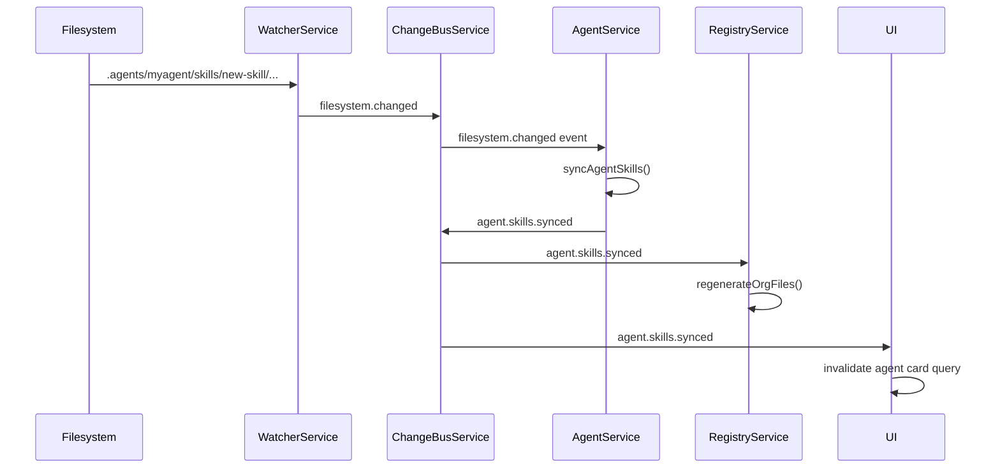

Agents are the fundamental autonomous units in Arkitec. Each agent is defined by an `agent.card.json` file that describes its capabilities, skills, and communication interfaces.

## Agent Card Structure

Every agent has a card defined by the `AgentCardSchema` from `src/main/services/agent/schemas/agent-card.ts`:

```typescript
interface AgentCard {
  name: string;                    // Display name
  description: string;             // What this agent does
  version: string;                 // Semantic version
  email?: string;                  // Contact/notification email
  capabilities: {
    streaming?: boolean;
    pushNotifications?: boolean;
    extendedAgentCard?: boolean;
  };
  defaultInputModes: string[];     // How agent receives input
  defaultOutputModes: string[];    // How agent produces output
  skills: AgentSkill[];            // Agent's skill set
  supportedInterfaces: {
    url: string;                   // Protocol endpoint URL
    protocolBinding: "JSONRPC" | "GRPC" | "HTTP+JSON";
    protocolVersion: string;
  }[];
}
```

### Example Agent Card

```json
{
  "name": "Backend Specialist",
  "description": "Autonomous agent specialized in API development and database design",
  "version": "1.0.0",
  "email": "backend@team.local",
  "capabilities": {
    "streaming": true,
    "pushNotifications": false,
    "extendedAgentCard": true
  },
  "defaultInputModes": ["text", "code"],
  "defaultOutputModes": ["text", "code", "diff"],
  "skills": [
    {
      "id": "typescript-api",
      "name": "TypeScript API Development",
      "description": "Build REST APIs with TypeScript and Express",
      "tags": ["typescript", "api", "backend"]
    }
  ],
  "supportedInterfaces": [
    {
      "url": "http://localhost:3000/rpc",
      "protocolBinding": "JSONRPC",
      "protocolVersion": "2.0"
    }
  ]
}
```

<Info>
Agent cards are automatically synced with the filesystem. When you add or remove skill directories, the card updates automatically via the Change Bus (see `agent.service.ts:228`).
</Info>

## Skills

Skills define what an agent can do. Each skill is represented by:

1. **A directory** under `.agents/skills/<skill-id>/`
2. **An entry in the agent card** with metadata

### Skill Schema

```typescript
interface AgentSkill {
  id: string;          // Unique identifier (matches directory name)
  name: string;        // Display name
  description: string; // What the skill does
  tags: string[];      // Categorization tags
}
```

### Skill Synchronization

From `agent.service.ts:228-274`, the `syncAgentSkills` method:

1. Reads skill directories from disk (`.agents/skills/`)
2. Compares with skills in the agent card
3. Adds new skills found on disk
4. Removes skills no longer present
5. Publishes `agent.card.updated` and `agent.skills.synced` events

```typescript
// Automatic skill sync triggered by filesystem changes
private onWorkspaceEvent(event: WorkspaceChangeEvent): void {
  if (event.kind !== "filesystem.changed" || event.type === "error") {
    return;
  }

  const agentMatch = event.path.match(/^\.agents\/([^/]+)\//);
  if (!agentMatch) {
    return;
  }

  const directory = `.agents/${agentMatch[1]}`;
  void this.syncAgentSkills(directory);
}
```

<Note>
Skill syncing is **debounced** and uses a `pendingSyncs` set to prevent duplicate operations. Changes are typically reflected within 200-500ms.
</Note>

## Agent Hierarchy

Agents organize into parent-child relationships based on directory nesting. From `inspector.service.ts:484-512`:

```typescript
private buildOrganizationTree(nodes: Map<string, AgentNode>): AgentNode[] {
  const roots: AgentNode[] = [];

  for (const [directory, node] of nodes) {
    let parentDir = "";
    let parentDirLength = 0;

    // Find the longest matching parent directory
    for (const otherDir of nodes.keys()) {
      if (otherDir === directory) continue;
      
      const prefix = `${otherDir}${path.sep}`;
      if (directory.startsWith(prefix) && otherDir.length > parentDirLength) {
        parentDir = otherDir;
        parentDirLength = otherDir.length;
      }
    }

    if (!parentDir) {
      roots.push(node);  // Top-level agent
    } else {
      nodes.get(parentDir)?.subAgents.push(node);  // Child agent
    }
  }

  return roots;
}
```

### Organization Structure

```typescript
interface AgentNode {
  name: string;        // From agent.card.json or directory basename
  email?: string;      // From agent.card.json
  directory: string;   // Absolute path
  skills: AgentSkill[];
  subAgents: AgentNode[];  // Nested agents
}
```

### Example Hierarchy

```
workspace/
├── engineering-lead/          # Root agent
│   ├── ark.config.json
│   ├── agent.card.json
│   ├── backend-team/          # Sub-agent
│   │   ├── ark.config.json
│   │   ├── agent.card.json
│   │   └── api-specialist/    # Nested sub-agent
│   │       ├── ark.config.json
│   │       └── agent.card.json
│   └── frontend-team/         # Another sub-agent
│       ├── ark.config.json
│       └── agent.card.json
```

Resulting organization tree:

```json
[
  {
    "name": "Engineering Lead",
    "directory": "/workspace/engineering-lead",
    "skills": [...],
    "subAgents": [
      {
        "name": "Backend Team",
        "directory": "/workspace/engineering-lead/backend-team",
        "skills": [...],
        "subAgents": [
          {
            "name": "API Specialist",
            "directory": "/workspace/engineering-lead/backend-team/api-specialist",
            "skills": [...],
            "subAgents": []
          }
        ]
      },
      {
        "name": "Frontend Team",
        "directory": "/workspace/engineering-lead/frontend-team",
        "skills": [...],
        "subAgents": []
      }
    ]
  }
]
```

## Agent Lifecycle

### Creating an Agent

From `agent.service.ts:85-120`:

```typescript
async createAgent(directory: string, name: string) {
  // 1. Create directory structure
  await this.fss.mkdir(directory, false);
  
  // 2. Create agent card with default template
  const card = buildDefaultAgentCard(name);
  const adapter = new JSONFile<AgentCard>(cardPath);
  const db = new Low<AgentCard>(adapter, card);
  await db.write();
  
  // 3. Initialize agent files (skills directory, etc.)
  await this.minter.initAgentFiles(directory);
  
  return directory;
}
```

### Updating Agent Cards

Changes to agent cards trigger events:

```typescript
async updateAgentCard(directory: string, card: AgentCard) {
  // Validate with Zod schema
  const parseResult = AgentCardSchema.safeParse(card);
  if (!parseResult.success) {
    return r.fail(AgentErrors.AgentCardValidationError, ...);
  }
  
  // Update the card file
  const db = await this.getCardDb(directory);
  db.data = parseResult.data;
  await db.write();
  
  // Notify subscribers via Change Bus
  this.publishCardUpdated(directory);
}
```

### Managing Skills

Adding a skill:

```typescript
async addSkillToCard(directory: string, skill: AgentSkill) {
  const db = await this.getCardDb(directory);
  
  // Check for duplicates
  if (_.some(db.data.skills, { id: skill.id })) {
    return r.fail(AgentErrors.SkillAlreadyExistsError, ...);
  }
  
  // Add to card
  db.data.skills = [...db.data.skills, skill];
  
  // Install skill files
  await this.skills.installSkill({ directory, skillId: skill.id });
  
  // Persist and notify
  await db.write();
  this.publishCardUpdated(directory);
  this.publishSkillsSynced(directory);
}
```

## Agent File Paths

From `paths.service.ts`, agents use standardized paths:

```typescript
// Agent card location
getAgentCardPath(directory: string)
// -> {directory}/agent.card.json

// Skills directory
getSkillsPath(directory: string)
// -> {directory}/.agents/skills

// Memory/log file (from ark.config.json logPath)
getMemoryLogPath(directory: string)
// -> {directory}/.arkitec/run.log (default)

// Tasks file (from ark.config.json tasksPath)
getTasksPath(directory: string)
// -> {directory}/.arkitec/tasks.json (default)

// Organization hierarchy
getOrganisationPath(directory: string)
// -> {directory}/.arkitec/org.json
```

<Note>
All agent files are stored relative to the project directory, making each agent **self-contained and portable**.
</Note>

## Change Bus Integration

Agents publish events that other services can subscribe to:

### Published Events

```typescript
// When agent card is updated
{
  kind: "agent.card.updated",
  directory: string,
  timestamp: number
}

// When skills are synchronized
{
  kind: "agent.skills.synced",
  directory: string,
  timestamp: number
}
```

### Event Flow



## Best Practices

<CardGroup cols={2}>
  <Card title="Use Semantic Versioning" icon="code-branch">
    Update the `version` field when agent capabilities change significantly
  </Card>
  <Card title="Descriptive Skills" icon="list-check">
    Give skills clear names and descriptions for better discoverability
  </Card>
  <Card title="Email Notifications" icon="envelope">
    Set the `email` field to enable agent-to-human communication
  </Card>
  <Card title="Tag Appropriately" icon="tags">
    Use consistent tags across agents for easier filtering and organization
  </Card>
</CardGroup>

## Related Concepts

- [Projects](/concepts/projects) - Configure agent scheduling and execution
- [Workspaces](/concepts/workspaces) - Organize multiple agents
- [Change Bus](/concepts/change-bus) - Event-driven synchronization
