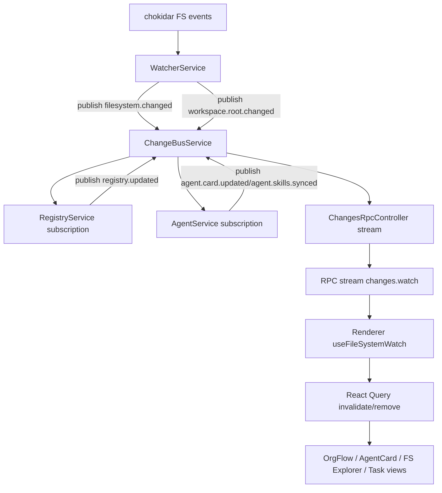
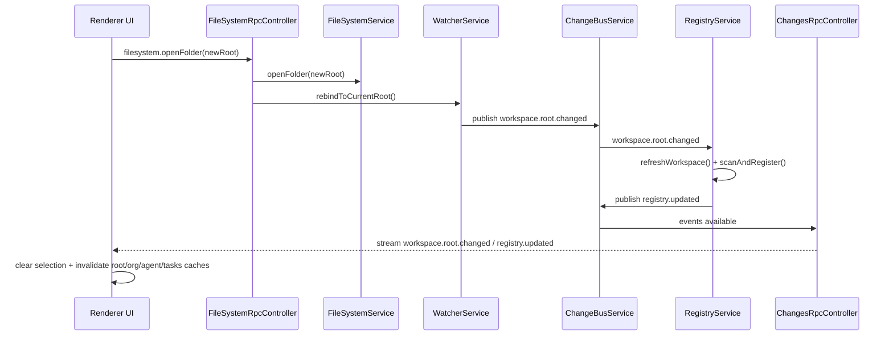

The Change Bus is Arkitec's central event pipeline that decouples services and keeps the entire system synchronized. It implements a publish-subscribe pattern where services emit typed events and subscribers react accordingly.

## Architecture Goals

From `ARCHITECTURE.md:5-10`:

> - Use one canonical event pipeline from main process to renderer.
> - Keep service logic domain-focused (registry, agent, filesystem) instead of UI-coupled.
> - Make updates resilient to event bursts (debounce, coalescing, bounded queues).
> - Keep renderer refresh targeted via React Query invalidation.

## Core Components

### ChangeBusService

In-memory pub/sub for typed workspace events. Provides:

```typescript
class ChangeBusService {
  // Publish an event to all subscribers
  publish(event: WorkspaceChangeEvent): void;
  
  // Subscribe to all events
  subscribe(handler: (event: WorkspaceChangeEvent) => void): () => void;
}
```

**Key characteristics:**
- **Type-safe** - All events use TypeScript interfaces
- **Synchronous** - Events are delivered immediately to subscribers
- **Decoupled** - Publishers don't know about subscribers
- **Simple** - No complex routing or filtering

### WatcherService

Monitors the filesystem using `chokidar` and publishes events.

From `ARCHITECTURE.md:16-20`:

> - Uses `chokidar` to observe workspace root.
> - Normalizes paths, filters ignored directories, and emits `filesystem.changed`.
> - Emits `workspace.root.changed` when watcher rebinds to a new root.

### ChangesRpcController

Streams events from main process to renderer over RPC.

From `ARCHITECTURE.md:25-28`:

> - Streams `WorkspaceChangeEvent` to renderer over RPC (`changes.stream.watch`).
> - Uses bounded `AsyncQueue` to avoid unbounded backpressure.

<Info>
The bounded queue protects against UI backpressure during high-frequency file changes. If the queue fills, older events are dropped to prevent memory issues.
</Info>

## Event Contracts

All events are defined in `src/main/services/changes/types.ts`:

### filesystem.changed

Emitted when files are added, modified, or deleted:

```typescript
{
  kind: "filesystem.changed",
  type: "add" | "change" | "unlink" | "error",
  path: string,           // Relative to workspace root
  timestamp: number
}
```

**Examples:**

```typescript
// File created
{ kind: "filesystem.changed", type: "add", path: "project/ark.config.json", timestamp: 1234567890 }

// File modified
{ kind: "filesystem.changed", type: "change", path: "project/cron.md", timestamp: 1234567891 }

// File deleted
{ kind: "filesystem.changed", type: "unlink", path: "project/old-file.txt", timestamp: 1234567892 }
```

### workspace.root.changed

Emitted when the workspace root directory changes:

```typescript
{
  kind: "workspace.root.changed",
  previousRoot: string,
  newRoot: string,
  timestamp: number
}
```

### registry.updated

Emitted when the project registry changes:

```typescript
{
  kind: "registry.updated",
  reason: RegistryChangeReason,  // "scan" | "register" | "unregister" | "reschedule" | "workspace.refresh"
  directory?: string,            // Affected project directory (if applicable)
  projectCount: number,          // Total registered projects
  timestamp: number
}
```

### agent.card.updated

Emitted when an agent card is modified:

```typescript
{
  kind: "agent.card.updated",
  directory: string,   // Agent directory
  timestamp: number
}
```

### agent.skills.synced

Emitted when agent skills are synchronized with disk:

```typescript
{
  kind: "agent.skills.synced",
  directory: string,
  timestamp: number
}
```

## End-to-End Flow

From `ARCHITECTURE.md:72-89`:



### Flow Description

1. **Filesystem Event** - User edits `ark.config.json`
2. **Chokidar Detection** - WatcherService detects file change
3. **Event Publishing** - WatcherService publishes `filesystem.changed`
4. **Service Subscriptions** - RegistryService and AgentService receive event
5. **Domain Logic** - RegistryService parses config and reschedules cron
6. **Secondary Events** - RegistryService publishes `registry.updated`
7. **RPC Stream** - ChangesRpcController sends events to renderer
8. **UI Invalidation** - React Query invalidates affected queries
9. **View Refresh** - UI components re-render with fresh data

## Service Subscriptions

### RegistryService

From `ARCHITECTURE.md:29-36`:

> Subscribes to change bus (`setupChangeSubscriptions`).
> Reacts to:
> - `filesystem.changed` for `ark.config.json` add/change/unlink.
> - `workspace.root.changed` to trigger `refreshWorkspace()`.
> Uses debounced/coalesced queue for config updates.
> Emits `registry.updated` after scan/register/unregister/reschedule/refresh.

**Implementation from `inspector.service.ts:531-578`:**

```typescript
setupChangeSubscriptions(): Result<void, RegistryError> {
  this.unsubscribeFromChanges?.();

  this.unsubscribeFromChanges = this.changes.subscribe((event) => {
    this.onWorkspaceEvent(event);
  });

  return r.success(undefined);
}

private onWorkspaceEvent(event: WorkspaceChangeEvent): void {
  // Handle workspace root changes
  if (event.kind === "workspace.root.changed") {
    this.resetPendingConfigEvents();
    void this.refreshWorkspace();
    return;
  }

  // Handle agent card updates (for org regeneration)
  if (event.kind === "agent.card.updated") {
    this.scheduleOrgRegeneration();
    return;
  }

  // Handle filesystem changes
  if (event.kind !== "filesystem.changed") return;
  if (event.type === "error") return;

  // Config file changes
  if (event.path.endsWith(ARK_CONFIG_FILE)) {
    const relativeDirectory = this.normalizeConfigDirectory(event.path);
    const action = event.type === "unlink" ? "unlink" : "upsert";
    this.enqueueConfigEvent(relativeDirectory, action);
    return;
  }

  // Agent card changes
  if (event.path.endsWith(AGENT_CARD_FILE)) {
    this.scheduleOrgRegeneration();
  }
}
```

### AgentService

From `ARCHITECTURE.md:38-43`:

> Subscribes to change bus (`setupChangeSubscriptions`).
> Reacts to `.agents/<name>/...` file changes and syncs card skills.
> Emits:
> - `agent.card.updated`
> - `agent.skills.synced`

**Implementation from `agent.service.ts:303-331`:**

```typescript
private onWorkspaceEvent(event: WorkspaceChangeEvent): void {
  if (event.kind !== "filesystem.changed" || event.type === "error") {
    return;
  }

  // Match .agents/<name>/ paths
  const agentMatch = event.path.match(/^\.agents\/([^/]+)\//);
  if (!agentMatch) return;

  const agentName = agentMatch[1];
  const directory = `.agents/${agentName}`;

  // Debounce rapid changes
  if (this.pendingSyncs.has(directory)) return;

  this.pendingSyncs.add(directory);
  void this.syncAgentSkills(directory)
    .catch((error) => {
      console.error(`[AgentService] Failed to sync agent skills for ${directory}:`, error);
    })
    .finally(() => {
      this.pendingSyncs.delete(directory);
    });
}
```

## Registry Config Event Coalescing

From `ARCHITECTURE.md:115-127`:

> The registry does not process every `ark.config.json` event immediately.
>
> 1. `filesystem.changed` for `ark.config.json` is mapped to action:
>    - `unlink` -> `unlink`
>    - `add/change` -> `upsert`
> 2. Events are queued by relative directory (`Map<dir, action>`).
> 3. Debounced flush (~200ms) runs sequentially.
> 4. Conflict rule: `unlink` wins if both appear during the same debounce window.
> 5. `unlink` path checks whether config still exists before unregistering.
>
> This reduces duplicate reschedules and race conditions from editor save bursts.

### Coalescing Logic

```typescript
private enqueueConfigEvent(
  relativeDirectory: string,
  action: "upsert" | "unlink",
): void {
  const current = this.pendingConfigEvents.get(relativeDirectory);

  // Conflict resolution: unlink wins
  if (current === "unlink" || action === "unlink") {
    this.pendingConfigEvents.set(relativeDirectory, "unlink");
  } else {
    this.pendingConfigEvents.set(relativeDirectory, action);
  }

  // Debounce flush
  if (this.configEventFlushTimer) {
    clearTimeout(this.configEventFlushTimer);
  }

  this.configEventFlushTimer = setTimeout(() => {
    this.configEventFlushTimer = null;
    void this.flushConfigEvents();
  }, this.configEventDebounceMs);
}
```

<Note>
Coalescing prevents the registry from rescheduling the same project multiple times when an editor performs atomic save operations (write temp file, delete old, rename temp).
</Note>

## Workspace Root Switch Flow

From `ARCHITECTURE.md:91-113`:



### Critical Steps

1. **Workspace Switch** - User opens new folder
2. **Watcher Rebind** - WatcherService starts watching new root
3. **Registry Clear** - All existing cron tasks stopped and removed
4. **Full Rescan** - New workspace scanned for projects
5. **UI Reset** - All caches invalidated, selection cleared

## Renderer Integration

From `ARCHITECTURE.md:49-57`:

> **useFileSystemWatch** (`src/renderer/hooks/rpc/fs.watch.ts`)
> - Subscribes to `services.changes.stream.watch(...)`.
> - Converts typed events into targeted query invalidation/removal:
>   - `filesystem.changed` -> tree + selected file refresh
>   - `registry.updated` -> org flow refresh
>   - `agent.card.updated` / `agent.skills.synced` -> agent card refresh
>   - `workspace.root.changed` -> clear selection + invalidate/remove root-scoped caches

### Event-to-Query Mapping

```typescript
// Pseudo-code from renderer
useFileSystemWatch({
  onEvent: (event) => {
    switch (event.kind) {
      case "filesystem.changed":
        queryClient.invalidateQueries(['fileTree']);
        queryClient.invalidateQueries(['fileContent', event.path]);
        break;
        
      case "registry.updated":
        queryClient.invalidateQueries(['organization']);
        queryClient.invalidateQueries(['projects']);
        break;
        
      case "agent.card.updated":
        queryClient.invalidateQueries(['agentCard', event.directory]);
        break;
        
      case "agent.skills.synced":
        queryClient.invalidateQueries(['agentCard', event.directory]);
        break;
        
      case "workspace.root.changed":
        queryClient.removeQueries();  // Clear all caches
        queryClient.invalidateQueries(['workspaceRoot']);
        break;
    }
  }
});
```

## Backpressure Protection

The ChangesRpcController uses a bounded `AsyncQueue`:

```typescript
class ChangesRpcController {
  private eventQueue = new AsyncQueue<WorkspaceChangeEvent>({
    maxSize: 100,  // Drop oldest events if queue fills
  });
  
  async *streamChanges() {
    for await (const event of this.eventQueue) {
      yield event;
    }
  }
}
```

**Why this matters:**

- **High-Frequency Changes** - Mass file operations (e.g., `git checkout`)
- **Slow Renderer** - UI can't process events fast enough
- **Memory Protection** - Prevents unbounded queue growth

<Info>
In practice, the queue rarely fills. The 100-event limit handles ~100 simultaneous file changes, which is sufficient for most workflows.
</Info>

## Extension Pattern

From `ARCHITECTURE.md:143-152`:

> When adding a new feature that should react to workspace changes:
>
> 1. Add event type in `src/main/services/changes/types.ts`.
> 2. Publish event from the owning service.
> 3. If needed, subscribe in another main service via `ChangeBusService.subscribe`.
> 4. If UI needs refresh, handle event in `src/renderer/hooks/rpc/fs.watch.ts`.
>
> This keeps all cross-service synchronization explicit and traceable.

### Example: Adding a New Event

**Step 1: Define Event Type**

```typescript
// types.ts
export type WorkspaceChangeEvent =
  | FilesystemChangedEvent
  | WorkspaceRootChangedEvent
  | RegistryUpdatedEvent
  | AgentCardUpdatedEvent
  | AgentSkillsSyncedEvent
  | MyNewEvent;  // Add new event

interface MyNewEvent {
  kind: "my.new.event";
  data: string;
  timestamp: number;
}
```

**Step 2: Publish Event**

```typescript
// my-service.ts
class MyService {
  constructor(
    @inject(ChangesService) private changes: ChangesService,
  ) {}
  
  async doSomething() {
    // ... business logic ...
    
    this.changes.publish({
      kind: "my.new.event",
      data: "something happened",
      timestamp: Date.now(),
    });
  }
}
```

**Step 3: Subscribe in Main (Optional)**

```typescript
// other-service.ts
class OtherService implements Bootstrappable {
  onInit() {
    this.changes.subscribe((event) => {
      if (event.kind === "my.new.event") {
        console.log("Reacting to:", event.data);
      }
    });
  }
}
```

**Step 4: Handle in Renderer (Optional)**

```typescript
// fs.watch.ts
case "my.new.event":
  queryClient.invalidateQueries(['myFeature']);
  break;
```

## Why This Is Maintainable

From `ARCHITECTURE.md:129-141`:

> - **Single transport**: renderer listens to one stream (`changes.watch`).
> - **Separation of concerns**:
>   - watcher detects low-level file events,
>   - services decide domain meaning,
>   - renderer only invalidates caches.
> - **Typed events** prevent ad-hoc string channels.
> - **Backpressure control** via bounded queue protects long sessions.
> - **Extensible**: adding a new domain event only requires:
>   - type addition in `changes/types.ts`
>   - producer publish call
>   - optional renderer invalidation mapping

## Best Practices

<CardGroup cols={2}>
  <Card title="Publish Specific Events" icon="bullseye">
    Create focused event types rather than generic "something.changed" events
  </Card>
  <Card title="Debounce High-Frequency" icon="clock">
    Use debouncing (200ms) for events that can fire rapidly
  </Card>
  <Card title="Include Context" icon="info-circle">
    Add relevant data to events (directory, reason, timestamp)
  </Card>
  <Card title="Document Event Flow" icon="diagram-project">
    Use sequence diagrams to show complex event chains
  </Card>
</CardGroup>

## Common Patterns

### Debounced Event Handler

```typescript
class MyService {
  private debounceTimer: ReturnType<typeof setTimeout> | null = null;
  private readonly debounceMs = 200;
  
  private onWorkspaceEvent(event: WorkspaceChangeEvent) {
    if (this.debounceTimer) {
      clearTimeout(this.debounceTimer);
    }
    
    this.debounceTimer = setTimeout(() => {
      this.debounceTimer = null;
      this.handleEvent(event);
    }, this.debounceMs);
  }
}
```

### Event Coalescing

```typescript
class MyService {
  private pendingUpdates = new Map<string, UpdateAction>();
  
  private enqueueUpdate(id: string, action: UpdateAction) {
    // Merge or replace based on business logic
    const existing = this.pendingUpdates.get(id);
    this.pendingUpdates.set(id, mergeActions(existing, action));
    
    this.scheduleFlush();
  }
  
  private async flushUpdates() {
    for (const [id, action] of this.pendingUpdates) {
      await this.applyUpdate(id, action);
    }
    this.pendingUpdates.clear();
  }
}
```

### Conditional Subscription

```typescript
class MyService {
  setupChangeSubscriptions() {
    this.changes.subscribe((event) => {
      // Only handle relevant events
      if (event.kind === "filesystem.changed" && 
          event.path.endsWith(".myext")) {
        this.handleMyFileChange(event);
      }
    });
  }
}
```

## Related Concepts

- [Workspaces](/concepts/workspaces) - How workspace changes trigger events
- [Projects](/concepts/projects) - Config changes flow through the bus
- [Agents](/concepts/agents) - Agent updates publish events
