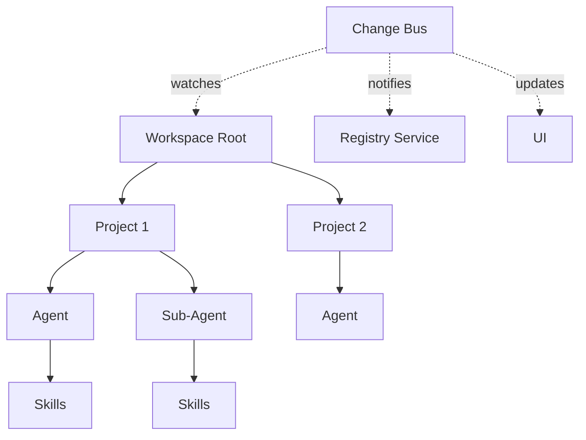

Arkitec is an event-driven autonomous agent orchestration system built on four core concepts that work together to create a flexible, scalable agent infrastructure.

## Architecture at a Glance

Arkitec organizes autonomous agents into hierarchical projects with automatic discovery, scheduling, and inter-agent communication.

<CardGroup cols={2}>
  <Card title="Agents" icon="robot" href="/concepts/agents">
    Self-contained units with skills, agent cards, and hierarchical organization
  </Card>
  <Card title="Projects" icon="folder" href="/concepts/projects">
    Configured workspaces with `ark.config.json` that define agent behavior and scheduling
  </Card>
  <Card title="Workspaces" icon="sitemap" href="/concepts/workspaces">
    Root directories containing multiple projects with automatic discovery
  </Card>
  <Card title="Change Bus" icon="bolt" href="/concepts/change-bus">
    Event-driven architecture that keeps all services synchronized
  </Card>
</CardGroup>

## How They Work Together



### The Flow

1. **Workspace** - You open a folder containing multiple agent projects
2. **Registry Discovery** - The `InspectorService` scans for all `ark.config.json` files
3. **Project Registration** - Each project is registered with its configuration and schedule
4. **Agent Organization** - Agents are organized into a hierarchy based on directory structure
5. **Change Synchronization** - The Change Bus keeps everything in sync when files change
6. **Scheduled Execution** - Projects run on their configured cron schedules

<Info>
The entire system is designed to be **self-healing** - if you change a configuration file, add a skill, or update an agent card, the system automatically detects and applies the changes.
</Info>

## Key Design Principles

### Event-Driven Architecture

All services communicate through a centralized Change Bus rather than direct coupling. This means:

- **Decoupled Services** - No service directly calls another's methods
- **Typed Events** - All events are strongly typed TypeScript interfaces
- **Resilient Updates** - Debouncing and coalescing prevent event storms
- **Predictable Flow** - Single canonical pipeline from filesystem to UI

### File-Based Configuration

Everything in Arkitec is configured through files:

- `ark.config.json` - Project configuration and scheduling
- `agent.card.json` - Agent metadata and capabilities  
- `.arkitec/org.json` - Auto-generated organization hierarchy
- `cron.md` - Instructions for autonomous agents

<Note>
This file-based approach means your agent infrastructure is **version-controllable** and can be managed with standard development tools.
</Note>

### Hierarchical Organization

Agents naturally organize into parent-child relationships based on directory structure:

```
workspace/
├── team-lead/               # Root agent
│   ├── ark.config.json
│   ├── agent.card.json
│   └── backend-specialist/  # Sub-agent
│       ├── ark.config.json
│       └── agent.card.json
└── designer/                # Another root agent
    ├── ark.config.json
    └── agent.card.json
```

This structure is automatically detected and reflected in the UI organization view.

### Automatic Discovery

No manual registration required:

- Drop an `ark.config.json` into any directory
- The watcher detects it within ~200ms (debounced)
- Registry automatically registers and schedules the project
- UI updates via Change Bus events

## Next Steps

<CardGroup cols={2}>
  <Card title="Learn About Agents" icon="robot" href="/concepts/agents">
    Understand agent cards, skills, and capabilities
  </Card>
  <Card title="Configure Projects" icon="gear" href="/concepts/projects">
    Set up `ark.config.json` for your agents
  </Card>
</CardGroup>
