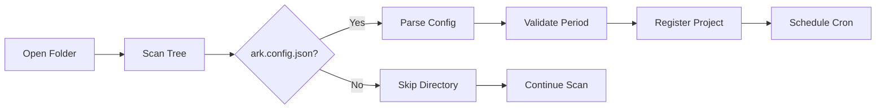

Projects are configured workspaces that define how and when autonomous agents run. Each project is identified by an `ark.config.json` file and is automatically discovered and scheduled by the Registry Service.

## ark.config.json

The project configuration file that defines agent behavior:

```typescript
interface ArkitecConfig {
  command: string[];      // Command to execute (e.g., ["opencode", "run", "..."])
  period: string;         // Cron schedule (e.g., "*/30 * * * *")
  logPath: string;        // Where to write execution logs
  tasksPath?: string;     // Optional tasks file location
  apiKey?: string;        // Optional API key for external services
}
```

### Default Configuration

From `config.service.ts:31-41`:

```json
{
  "command": [
    "opencode",
    "run",
    "You are an autonomous agent. Read @cron.md to see what to do."
  ],
  "period": "*/30 * * * *",
  "logPath": "/.arkitec/run.log",
  "tasksPath": "/.arkitec/tasks.json"
}
```

<Info>
The default configuration runs the agent every 30 minutes using OpenCode, with all state stored in the `.arkitec/` directory.
</Info>

## Configuration Fields

### command

The command array to execute when the cron schedule triggers. This typically invokes an AI coding assistant with instructions.

```json
{
  "command": [
    "opencode",
    "run",
    "You are a backend specialist. Check @cron.md for your tasks."
  ]
}
```

**Common patterns:**

- `["opencode", "run", "<instructions>"]` - Use OpenCode CLI
- `["node", "scripts/agent.js"]` - Custom Node.js script
- `["python", "agent.py"]` - Python-based agent
- `["bash", "run-agent.sh"]` - Shell script

### period

A cron expression that determines when the agent runs. Must be a valid cron schedule.

**Examples:**

```json
// Every 30 minutes
{ "period": "*/30 * * * *" }

// Every hour at :15
{ "period": "15 * * * *" }

// Every day at 9 AM
{ "period": "0 9 * * *" }

// Every Monday at 8 AM
{ "period": "0 8 * * 1" }

// Every 5 minutes (for testing)
{ "period": "*/5 * * * *" }
```

<Note>
Cron schedules are validated using `CronService.validateSchedule()` when the config is parsed (see `parser.ts:34`). Invalid schedules will prevent project registration.
</Note>

### logPath

Relative path (from project directory) where execution logs are written.

```json
{
  "logPath": "/.arkitec/run.log"  // Default
}

// Or custom path:
{
  "logPath": "/logs/agent-output.log"
}
```

Logs include:
- Command execution output
- Timestamps
- Error messages
- Agent decision logs

### tasksPath (optional)

Relative path to a tasks file that the agent can read and update.

```json
{
  "tasksPath": "/.arkitec/tasks.json"
}
```

Typically stores:
- Pending tasks
- Completed work
- Agent state between runs

### apiKey (optional)

API key for external services (e.g., AI model providers).

```json
{
  "apiKey": "sk-..."
}
```

<Note>
API keys are stored in plaintext. Consider using environment variables or secret management for production deployments.
</Note>

## Project Discovery

From `scanner.ts:5-30`, the Registry Service automatically finds projects:

```typescript
export async function findArkitecProjects(
  tree: FileTreeNode,
  rootPath: string,
): Promise<string[]> {
  const projects: string[] = [];

  const traverse = async (node: FileTreeNode) => {
    if (node.type === "directory") {
      const absoluteProjectPath = path.join(rootPath, node.path);
      const hasConfig = await hasArkitecConfig(absoluteProjectPath);

      if (hasConfig) {
        projects.push(node.path);  // Found a project!
      }

      if (node.children) {
        for (const child of node.children) {
          await traverse(child);  // Recursive search
        }
      }
    }
  };

  await traverse(tree);
  return projects;
}
```

### Discovery Process

1. **Workspace Opened** - User opens a folder in Arkitec
2. **Tree Scan** - FileSystemService builds full directory tree
3. **Config Detection** - Scanner looks for `ark.config.json` in every directory
4. **Registration** - Each found project is parsed and registered
5. **Scheduling** - Cron tasks are created based on the `period` field



## Project Registration

From `inspector.service.ts:170-217`:

```typescript
async registerProject(
  directory: string,
  options?: { emitChange?: boolean },
): Promise<Result<ProjectConfig, RegistryError>> {
  // 1. Parse and validate config
  const configResult = await parseArkitecConfig(directory, this.cron);
  if (!configResult.success) return configResult;

  // 2. Check for duplicates
  if (this.registeredProjects.has(directory)) {
    return r.fail(
      RegistryErrors.AlreadyRegisteredError,
      `Project at "${directory}" is already registered`,
    );
  }

  // 3. Create project config
  const displayName = path.basename(directory);
  const taskId = `arkitec-${displayName}-${Date.now()}`;
  const projectConfig: ProjectConfig = {
    id: displayName,
    path: directory,
    config: configResult.data,
    taskId,
  };

  // 4. Schedule cron task
  const scheduleResult = await this.scheduleProjectTask({
    directory,
    config: configResult.data,
    taskId,
    failOnStartError: true,
    displayName,
  });
  if (!scheduleResult.success) return scheduleResult;

  // 5. Store and notify
  this.registeredProjects.set(directory, projectConfig);
  void this.regenerateOrgFiles();
  
  if (options?.emitChange !== false) {
    this.emitRegistryUpdated("register", directory);
  }

  return r.success(projectConfig);
}
```

### ProjectConfig Structure

```typescript
interface ProjectConfig {
  id: string;              // Directory basename (e.g., "my-agent")
  path: string;            // Absolute directory path
  config: ArkitecConfig;   // Parsed ark.config.json
  taskId?: string;         // Cron task identifier
}
```

## Live Configuration Updates

Changes to `ark.config.json` are automatically detected and applied.

### Config Change Flow

From `REGISTRY_SERVICE.md:60-76`:

1. **File Change** - User edits `ark.config.json`
2. **Watcher Detects** - WatcherService emits `filesystem.changed` event
3. **Event Queued** - Config event added to `pendingConfigEvents` map
4. **Debounce** - 200ms timer prevents rapid successive updates
5. **Apply Change** - `applyConfigEvent` processes upsert or unlink
6. **Reschedule** - If config changed, cron task is rescheduled

```typescript
// From inspector.service.ts:568-578
if (event.path.endsWith(ARK_CONFIG_FILE)) {
  const relativeDirectory = this.normalizeConfigDirectory(event.path);
  const action = event.type === "unlink" ? "unlink" : "upsert";
  this.enqueueConfigEvent(relativeDirectory, action);
  return;
}
```

### Conflict Resolution

From `ARCHITECTURE.md:119-126`:

> Conflict rule: `unlink` wins if both appear during the same debounce window.
> `unlink` path checks whether config still exists before unregistering.

This handles rapid save-delete-save sequences from editors.

## Project Lifecycle Operations

### Invoke Now

Manually trigger a project execution:

```typescript
async invokeProjectNow(directory: string) {
  // 1. Resolve project by directory
  const { project, taskId } = await this.resolveRunnableProject(directory);
  
  // 2. Ensure cron is started
  const startResult = this.cron.start(taskId);
  if (!startResult.success) return startResult;
  
  // 3. Trigger immediate execution
  const runNowResult = this.cron.runNow(taskId);
  return runNowResult;
}
```

### Stop Project

Stop a running cron task:

```typescript
async stopProjectNow(directory: string) {
  const { project, taskId } = await this.resolveRunnableProject(directory);
  const stopResult = this.cron.stop(taskId);
  return stopResult;
}
```

### Get Status

Check if a project is running:

```typescript
async getProjectStatus(directory: string) {
  const { project, taskId } = await this.resolveRunnableProject(directory);
  const taskResult = this.cron.getTask(taskId);
  
  return {
    projectId: project.id,
    taskId,
    isRunning: taskResult.data.isRunning,
  };
}
```

## Project Execution

From `executor.ts`, when a cron task triggers:

```typescript
async function executeCommand(
  directory: string,
  command: string[],
  executor: ExecutorService,
  logPath: string,
) {
  // 1. Execute command in project context
  const result = await executor.execute({
    command,
    workingDirectory: directory,
  });
  
  // 2. Write output to log file
  const absoluteLogPath = path.join(directory, logPath);
  await fsp.mkdir(path.dirname(absoluteLogPath), { recursive: true });
  await fsp.writeFile(
    absoluteLogPath,
    `[${new Date().toISOString()}] ${result.stdout}\n${result.stderr}`,
    { flag: 'a' },  // Append mode
  );
}
```

## Project Structure Example

```
my-agent/
├── ark.config.json          # Project configuration
├── agent.card.json          # Agent metadata
├── cron.md                  # Instructions for the agent
├── .arkitec/
│   ├── run.log             # Execution logs (from logPath)
│   ├── tasks.json          # Task state (from tasksPath)
│   └── org.json            # Organization hierarchy (auto-generated)
├── .agents/
│   └── skills/             # Agent skills directory
│       ├── skill-1/
│       └── skill-2/
└── opencode.json           # OpenCode configuration (optional)
```

<Info>
All `.arkitec/` files are **auto-generated** except for `tasks.json`, which the agent can read and modify.
</Info>

## Configuration Management

The `ConfigService` provides methods to manage configurations programmatically:

### Create Config

```typescript
await configService.createConfig(directory, {
  command: ["opencode", "run", "Custom instructions"],
  period: "0 */2 * * *",  // Every 2 hours
});
```

### Update Command

```typescript
await configService.updateCommand(directory, [
  "python",
  "agent.py",
  "--mode",
  "autonomous",
]);
```

### Update Schedule

```typescript
await configService.updateCron(directory, "*/15 * * * *");
// Automatically validates cron expression
```

### Update Multiple Fields

```typescript
await configService.updateConfig(directory, {
  period: "0 8 * * *",
  logPath: "/custom-logs/output.log",
  apiKey: "new-api-key",
});
```

## Best Practices

<CardGroup cols={2}>
  <Card title="Use Version Control" icon="code-branch">
    Commit `ark.config.json` to track configuration changes over time
  </Card>
  <Card title="Test Schedules" icon="clock">
    Start with frequent schedules (e.g., `*/5 * * * *`) during development, then reduce
  </Card>
  <Card title="Monitor Logs" icon="file-lines">
    Check `run.log` regularly to ensure agents are executing as expected
  </Card>
  <Card title="Relative Paths" icon="folder">
    Use paths relative to the project directory for portability
  </Card>
</CardGroup>

## Common Patterns

### Development Agent

Frequent execution with verbose logging:

```json
{
  "command": ["opencode", "run", "Development mode: check @cron.md and be verbose"],
  "period": "*/5 * * * *",
  "logPath": "/.arkitec/dev.log"
}
```

### Production Agent

Less frequent, focused on stability:

```json
{
  "command": ["opencode", "run", "Production mode: execute tasks from @cron.md"],
  "period": "0 */6 * * *",
  "logPath": "/.arkitec/prod.log"
}
```

### Testing Agent

On-demand execution only:

```json
{
  "command": ["npm", "test"],
  "period": "0 0 31 2 *",
  "logPath": "/.arkitec/test.log"
}
```

<Note>
The cron `0 0 31 2 *` (Feb 31st) never triggers, making the agent manual-only. Use `invokeProjectNow()` to run it.
</Note>

## Related Concepts

- [Agents](/concepts/agents) - Configure agent cards and skills
- [Workspaces](/concepts/workspaces) - Organize multiple projects  
- [Change Bus](/concepts/change-bus) - How config changes propagate
