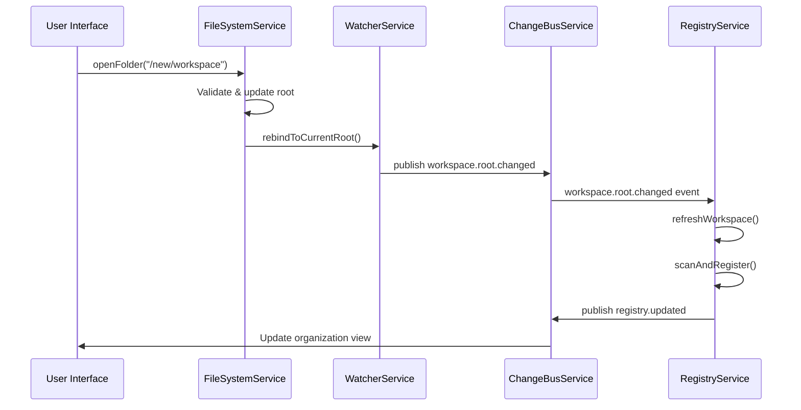
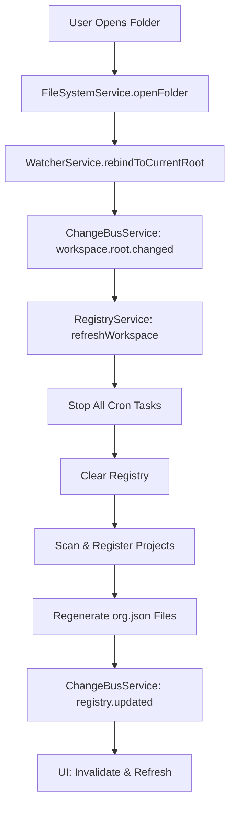

A workspace is the root directory that contains all your agent projects. Arkitec automatically discovers, organizes, and monitors all projects within the workspace.

## Workspace Root

The workspace root is managed by the `FileSystemService` from `fs.service.ts:22-32`:

```typescript
@injectable()
export class FileSystemService {
  private projectsRoot: string;

  constructor(@inject(StoreService) private readonly store: StoreService) {
    const savedFolder = this.store.getLastOpenedFolder();
    this.projectsRoot = path.resolve(
      process.env.ARKITEC_FS_ROOT || savedFolder || DEFAULT_PROJECTS_ROOT,
    );
  }
}
```

### Root Priority

1. **Environment Variable** - `ARKITEC_FS_ROOT` if set
2. **Last Opened Folder** - Persisted in application store
3. **Home Directory** - `os.homedir()` as fallback

<Info>
The workspace root is **persisted** between sessions. When you close and reopen Arkitec, it remembers your last workspace.
</Info>

## Opening a Workspace

From `fs.service.ts:63-92`:

```typescript
async openFolder(directory: string): Promise<Result<string, FsError>> {
  const normalizedInput = directory.trim();
  if (!normalizedInput) {
    return r.fail(FsErrors.InvalidPathError, "Folder path is required.");
  }

  const nextRoot = path.resolve(normalizedInput);
  const previousRoot = this.projectsRoot;
  const previousRootReady = this.rootReady;

  // Update root
  this.projectsRoot = nextRoot;
  this.rootReady = null;

  // Validate access
  const rootReadyResult = await r.try(
    () => this.ensureRootReady(),
    FsErrors.RootAccessError,
  );

  if (!rootReadyResult.success) {
    // Rollback on failure
    this.projectsRoot = previousRoot;
    this.rootReady = previousRootReady;
    return rootReadyResult;
  }

  // Persist new root
  this.store.setLastOpenedFolder(this.projectsRoot);
  return r.success(this.projectsRoot);
}
```

### Opening Flow

1. **Normalize Path** - Resolve to absolute path
2. **Backup Current State** - Save previous root for rollback
3. **Update Root** - Set new workspace root
4. **Validate Access** - Ensure directory exists and is readable
5. **Persist** - Save to store for next session
6. **Trigger Events** - WatcherService emits `workspace.root.changed`



## Workspace Structure

Typical workspace organization:

```
workspace/
├── project-1/                    # First project
│   ├── ark.config.json          # Project config
│   ├── agent.card.json          # Agent metadata
│   ├── cron.md                  # Agent instructions
│   ├── .arkitec/                # Generated files
│   │   ├── run.log
│   │   ├── tasks.json
│   │   └── org.json             # Full organization tree
│   └── .agents/
│       └── skills/
├── project-2/                    # Second project
│   ├── ark.config.json
│   ├── agent.card.json
│   └── sub-project/             # Nested project
│       ├── ark.config.json
│       └── agent.card.json
└── project-3/                    # Third project
    ├── ark.config.json
    └── agent.card.json
```

<Note>
Projects can be **nested** at any depth. Each `ark.config.json` represents an independent project with its own schedule and configuration.
</Note>

## File Tree Scanning

From `fs.service.ts:111-117`:

```typescript
async listTree(): Promise<Result<FileTreeNode, FsError>> {
  const rootPath = this.projectsRoot;
  return r.try(
    () => readTree(rootPath, "", rootPath),
    FsErrors.TreeReadError,
  );
}
```

### FileTreeNode Structure

```typescript
interface FileTreeNode {
  name: string;        // File or directory name
  path: string;        // Relative path from workspace root
  type: "file" | "directory";
  children?: FileTreeNode[];  // Subdirectories/files
}
```

### Example Tree

```json
{
  "name": "workspace",
  "path": "",
  "type": "directory",
  "children": [
    {
      "name": "project-1",
      "path": "project-1",
      "type": "directory",
      "children": [
        {
          "name": "ark.config.json",
          "path": "project-1/ark.config.json",
          "type": "file"
        },
        {
          "name": "agent.card.json",
          "path": "project-1/agent.card.json",
          "type": "file"
        }
      ]
    }
  ]
}
```

## Workspace Monitoring

The `WatcherService` monitors the entire workspace for changes using `chokidar`.

From `ARCHITECTURE.md:16-20`:

> **WatcherService** (`src/main/services/watcher/watcher.service.ts`)
> - Uses `chokidar` to observe workspace root.
> - Normalizes paths, filters ignored directories, and emits `filesystem.changed`.
> - Emits `workspace.root.changed` when watcher rebinds to a new root.

### Ignored Paths

Common directories excluded from watching:

```typescript
const IGNORED_DIRECTORIES = [
  'node_modules',
  '.git',
  'dist',
  'build',
  '.webpack',
  '.next',
  '.cache'
];
```

### Watch Events

```typescript
// File added or modified
{
  kind: "filesystem.changed",
  type: "add" | "change",
  path: "project-1/ark.config.json",
  timestamp: 1234567890
}

// File deleted
{
  kind: "filesystem.changed",
  type: "unlink",
  path: "project-1/ark.config.json",
  timestamp: 1234567890
}

// Workspace root changed
{
  kind: "workspace.root.changed",
  previousRoot: "/old/workspace",
  newRoot: "/new/workspace",
  timestamp: 1234567890
}
```

## Workspace Refresh

When the workspace root changes, the system performs a full refresh:

From `inspector.service.ts:87-112`:

```typescript
async refreshWorkspace(): Promise<Result<number, RegistryError>> {
  // 1. Stop all existing cron tasks
  for (const project of this.registeredProjects.values()) {
    if (!project.taskId) continue;
    
    const removeResult = this.cron.remove(project.taskId);
    if (!removeResult.success) {
      console.error(
        `[RegistryService] Failed to remove task ${project.taskId}: ${removeResult.error.message}`,
      );
    }
  }

  // 2. Clear registry
  this.registeredProjects.clear();

  // 3. Rescan workspace
  const scanResult = await this.scanAndRegister();
  if (!scanResult.success) return scanResult;

  // 4. Regenerate organization files
  void this.regenerateOrgFiles();
  
  // 5. Notify subscribers
  this.emitRegistryUpdated("workspace.refresh");

  return r.success(scanResult.data);
}
```

### Refresh Triggers

1. **User Opens New Folder** - Via `filesystem.openFolder()`
2. **Workspace Root Changed Event** - From WatcherService
3. **Manual Refresh** - Via UI or API call

## Path Resolution

All paths in Arkitec are resolved relative to the workspace root:

```typescript
// Convert relative to absolute
async getAbsolutePath(relativePath: string): Promise<Result<string, FsError>> {
  const rootPath = this.projectsRoot;
  return r.try(
    () => toAbsolutePath(relativePath, rootPath),
    FsErrors.InvalidPathError,
  );
}
```

### Path Examples

```typescript
// Workspace root: /home/user/workspace

getAbsolutePath("project-1/ark.config.json")
// -> /home/user/workspace/project-1/ark.config.json

getAbsolutePath(".agents/skills/typescript")
// -> /home/user/workspace/.agents/skills/typescript

getAbsolutePath("../outside-workspace")
// -> Error: Path must be within workspace root
```

<Note>
Paths are **security-restricted** to the workspace root. You cannot access files outside the workspace using relative paths.
</Note>

## Organization Files

Each registered project gets an auto-generated `.arkitec/org.json` file containing the full organization hierarchy.

From `inspector.service.ts:514-529`:

```typescript
private async regenerateOrgFiles(): Promise<void> {
  const agents = await this.getOrganization();
  const content = JSON.stringify(agents, null, 2);

  for (const directory of this.registeredProjects.keys()) {
    const orgPath = path.join(directory, ORG_FILE_RELATIVE_PATH);
    try {
      await fsp.mkdir(path.dirname(orgPath), { recursive: true });
      await fsp.writeFile(orgPath, content);
    } catch (error) {
      console.error(
        `[RegistryService] Failed to write org.json for ${directory}: ${error}`,
      );
    }
  }
}
```

### Organization File Content

Every project receives the **same** organization tree, showing all agents and their relationships:

```json
[
  {
    "name": "Engineering Lead",
    "email": "lead@team.local",
    "directory": "/workspace/engineering-lead",
    "skills": [
      { "id": "project-management", "name": "Project Management", ... }
    ],
    "subAgents": [
      {
        "name": "Backend Specialist",
        "directory": "/workspace/engineering-lead/backend",
        "skills": [...],
        "subAgents": []
      }
    ]
  }
]
```

<Info>
This allows agents to **discover and communicate** with other agents by reading their local `org.json` file.
</Info>

## Workspace Events

The Change Bus tracks workspace-level events:

### Published Events

```typescript
// Workspace root changed
{
  kind: "workspace.root.changed",
  previousRoot: string,
  newRoot: string,
  timestamp: number
}

// Registry updated (workspace-wide)
{
  kind: "registry.updated",
  reason: "scan" | "register" | "unregister" | "reschedule" | "workspace.refresh",
  directory?: string,
  projectCount: number,
  timestamp: number
}
```

### Event Flow



## Best Practices

<CardGroup cols={2}>
  <Card title="Organize by Team" icon="users">
    Group related agents in subdirectories (e.g., `backend/`, `frontend/`)
  </Card>
  <Card title="Use Descriptive Names" icon="signature">
    Name project directories clearly (e.g., `api-developer`, not `agent1`)
  </Card>
  <Card title="Version Control" icon="code-branch">
    Commit the entire workspace to track all agent configurations together
  </Card>
  <Card title="Avoid Deep Nesting" icon="sitemap">
    Keep hierarchy 2-3 levels deep for maintainability
  </Card>
</CardGroup>

## Common Workspace Patterns

### By Domain

```
workspace/
├── backend/
│   ├── api-developer/
│   ├── database-admin/
│   └── devops/
├── frontend/
│   ├── react-specialist/
│   └── ui-designer/
└── qa/
    ├── test-automation/
    └── manual-tester/
```

### By Project

```
workspace/
├── project-alpha/
│   ├── lead-agent/
│   ├── backend-agent/
│   └── frontend-agent/
└── project-beta/
    ├── lead-agent/
    └── fullstack-agent/
```

### Flat Structure

```
workspace/
├── agent-1/
├── agent-2/
├── agent-3/
└── agent-4/
```

<Note>
Flat structures work well for **small teams** (< 10 agents). Use hierarchy for larger organizations.
</Note>

## Workspace Persistence

The workspace root is persisted in the application store:

```typescript
// Save current workspace
this.store.setLastOpenedFolder(this.projectsRoot);

// Load on startup
const savedFolder = this.store.getLastOpenedFolder();
this.projectsRoot = path.resolve(
  process.env.ARKITEC_FS_ROOT || savedFolder || DEFAULT_PROJECTS_ROOT,
);
```

This ensures:
- **Session Continuity** - Same workspace on restart
- **User Preference** - Remembers last working directory
- **Environment Override** - `ARKITEC_FS_ROOT` takes priority

## Related Concepts

- [Projects](/concepts/projects) - Configure individual projects within a workspace
- [Agents](/concepts/agents) - Organize agents in the hierarchy
- [Change Bus](/concepts/change-bus) - Event-driven workspace monitoring
