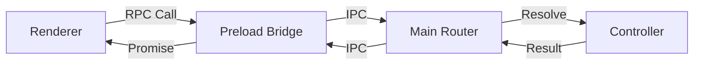

## Overview

Arkitec implements a custom RPC (Remote Procedure Call) system that provides type-safe, bidirectional communication between the Electron main and renderer processes.

**Key features:**
- Full TypeScript type inference across process boundaries
- Four communication patterns: invoke, send, stream, events
- Decorator-based controller registration
- Automatic serialization and error handling
- Zero runtime overhead in production

## Architecture

The RPC system consists of three layers:

<Steps>
  <Step title="Preload Bridge">
    Exposes a controlled IPC API to the renderer via `contextBridge`
  </Step>
  <Step title="Main Process Router">
    Routes IPC messages to appropriate controller methods
  </Step>
  <Step title="Renderer Client">
    Provides type-safe proxy for calling main process methods
  </Step>
</Steps>



## Preload Bridge

The preload script creates a secure bridge between processes.

### Bridge Implementation

```typescript
// src/preload.ts
import { contextBridge, ipcRenderer } from "electron";
import { RPC_CHANNELS } from "./shared/rpc/types";

const bridge: RpcBridge = {
  // Invoke: async request-response
  invoke: (request: RpcInvokeRequest) =>
    ipcRenderer.invoke(RPC_CHANNELS.invoke, request),

  // Send: fire-and-forget command
  send: (request: RpcSendRequest) => {
    ipcRenderer.send(RPC_CHANNELS.send, request);
  },

  // Events: subscribe to main process events
  onEvent: (listener: (event: RpcEventMessage) => void) => {
    const wrapped = (_event: unknown, payload: RpcEventMessage) => {
      listener(payload);
    };

    ipcRenderer.on(RPC_CHANNELS.event, wrapped);

    // Return cleanup function
    return () => {
      ipcRenderer.removeListener(RPC_CHANNELS.event, wrapped);
    };
  },

  // Streams: bidirectional chunked data
  openStream: (
    request: RpcStreamOpenRequest,
    onData: (chunk: unknown) => void,
    handlers?: StreamHandlers,
  ) => {
    const channel = new MessageChannel();
    const port = channel.port1;

    port.onmessage = (event: MessageEvent<RpcStreamPacket>) => {
      const packet = event.data;

      if (packet.type === "data") {
        onData(packet.data);
      } else if (packet.type === "error") {
        handlers?.onError?.(packet.error);
        cleanup();
      } else {
        handlers?.onEnd?.();
        cleanup();
      }
    };

    port.start();
    ipcRenderer.postMessage(RPC_CHANNELS.streamOpen, request, [channel.port2]);

    return cleanup;  // Return cleanup function
  },
};

// Expose bridge to renderer
contextBridge.exposeInMainWorld("rpcBridge", bridge);
```

<Warning>
Never expose `ipcRenderer` directly to the renderer. Always use `contextBridge` to create a controlled API surface.
</Warning>

### RPC Channels

```typescript
// src/shared/rpc/types.ts
export const RPC_CHANNELS = {
  invoke: "rpc:invoke",
  send: "rpc:send",
  event: "rpc:event",
  streamOpen: "rpc:stream:open",
  streamClose: "rpc:stream:close",
} as const;
```

## Main Process Router

The router registers IPC handlers and routes requests to controllers.

### Handler Registration

```typescript
// src/main/lib/rpc/router/register.ts
import { ipcMain } from "electron";
import { RPC_CHANNELS } from "@/shared/rpc/types";

export function registerRpcIpcHandlers(): void {
  // Handle invoke requests (async with return value)
  ipcMain.handle(
    RPC_CHANNELS.invoke,
    async (event, request: RpcInvokeRequest) => {
      const abortController = new AbortController();
      return runControllerMethod(
        event.sender,
        request,
        ["invoke", "listenable"],
        abortController.signal,
      );
    },
  );

  // Handle send requests (fire-and-forget)
  ipcMain.on(RPC_CHANNELS.send, (event, request: RpcSendRequest) => {
    const abortController = new AbortController();
    void runControllerMethod(
      event.sender,
      request,
      ["command"],
      abortController.signal,
    ).catch((error) => {
      void handleCommandError(event, request, error);
    });
  });

  // Handle stream requests
  ipcMain.on(RPC_CHANNELS.streamOpen, (event, request) => {
    void handleStream(event, request);
  });

  // Handle stream cleanup
  ipcMain.on(
    RPC_CHANNELS.streamClose,
    (_event, request: RpcStreamCloseRequest) => {
      closeStream(request.streamId);
    },
  );
}
```

### Controller Registry

Controllers are registered in a central registry:

```typescript
// src/main/lib/rpc/registry.ts
import { McpRpcController } from "@/main/services/mcp/mcp.rpc";
import { FileSystemRpcController } from "@main/services/fs/fs.rpc";
import { AgentRpcController } from "@main/services/agent/agent.rpc";

export const controllerRegistry = {
  filesystem: FileSystemRpcController,
  mcp: McpRpcController,
  agent: AgentRpcController,
  skills: SkillsRpcController,
  memory: MemoryRpcController,
  tasks: TasksRpcController,
} as const;

export type ControllerRegistry = typeof controllerRegistry;
```

## RPC Controllers

Controllers expose main process functionality to the renderer using decorators.

### Controller Decorators

<CodeGroup>
```typescript Decorators
// src/main/lib/rpc/decorators.ts
import "reflect-metadata";

// Mark a class as an RPC controller
export function RPCController(name?: string): ClassDecorator {
  return (target) => {
    const serviceName = name || target.name || "service";
    Reflect.defineMetadata(SERVICE_METADATA_KEY, serviceName, target);
  };
}

// Mark a method as invokable (async with return value)
export function invokable(): MethodDecorator {
  return defineProtocol("invoke");
}

// Mark a method as command (fire-and-forget)
export function command(): MethodDecorator {
  return defineProtocol("command");
}

// Mark a method as streamable (async generator)
export function streamable(): MethodDecorator {
  return defineProtocol("stream");
}

// Mark a method as listenable (event emitter)
export function listenable(eventName?: string): MethodDecorator {
  return defineProtocol("listenable", eventName);
}
```

```typescript Usage Example
// src/main/services/agent/agent.rpc.ts
import { injectable, inject } from "tsyringe";
import { RPCController, invokable } from "@main/lib/rpc/decorators";
import type { RpcContext } from "@/shared/rpc/types";

@RPCController("agent")
@injectable()
export class AgentRpcController {
  constructor(
    @inject(AgentService) private readonly agentService: AgentService,
  ) {}

  @invokable()
  async createAgent(
    ctx: RpcContext,
    parentPath: string,
    agentName: string,
  ): Promise<FileMutationResult> {
    if (ctx.signal.aborted) {
      throw new Error("Request aborted");
    }

    const directory = parentPath ? `${parentPath}/${agentName}` : agentName;
    const result = await this.agentService.createAgent(directory, agentName);

    if (!result.success) {
      throw new Error(`${result.error.type}: ${result.error.message}`);
    }
    return result.data;
  }

  @invokable()
  async getAgentCard(ctx: RpcContext, directory: string): Promise<AgentCard> {
    if (ctx.signal.aborted) {
      throw new Error("Request aborted");
    }

    const result = await this.agentService.getAgentCard(directory);
    if (!result.success) {
      throw new Error(`${result.error.type}: ${result.error.message}`);
    }
    return result.data;
  }
}
```
</CodeGroup>

### RPC Context

Every controller method receives an `RpcContext` as its first parameter:

```typescript
export interface RpcContext {
  emit(event: string, payload: unknown): void;  // Emit events to renderer
  signal: AbortSignal;                          // Request cancellation
}
```

**Usage:**
```typescript
@invokable()
async processLargeFile(ctx: RpcContext, path: string) {
  // Check if request was cancelled
  if (ctx.signal.aborted) {
    throw new Error("Request aborted");
  }

  // Emit progress events
  ctx.emit("progress", { percent: 50 });

  // Continue processing...
}
```

## Renderer Client

The renderer uses a type-safe proxy to call main process methods.

### Client Implementation

```typescript
// src/renderer/services.ts
import type { ControllerRegistry } from "../main/lib/rpc/registry";
import type { RendererServices, RpcBridge } from "../shared/rpc/types";

function getBridge(): RpcBridge {
  const bridge = (window as any).rpcBridge;
  if (!bridge) {
    throw new Error("RPC bridge is not available");
  }
  return bridge;
}

function createServiceProxy(
  service: string,
  bridge: RpcBridge,
): Record<string, unknown> {
  const on = createOnHandler(service, bridge);
  const send = createSendProxy(service, bridge);
  const stream = createStreamProxy(service, bridge);

  return new Proxy({}, {
    get: (_target, prop: string) => {
      if (prop === "on") return on;
      if (prop === "send") return send;
      if (prop === "stream") return stream;

      // Default: invoke method
      return (...args: unknown[]) =>
        bridge.invoke({
          service,
          method: prop,
          args,
        });
    },
  });
}

export const services = createRpcClient<ControllerRegistry>();
```

### Type Safety

The type system ensures correct usage:

```typescript
// src/shared/rpc/types.ts
type ControllerMethodName<TController> = Extract<
  {
    [K in keyof TController]: TController[K] extends (
      ctx: RpcContext,
      ...args: unknown[]
    ) => unknown
      ? K
      : never;
  }[keyof TController],
  string
>;

type MethodArgs<TController, TMethod> = 
  TController[TMethod] extends (ctx: RpcContext, ...args: infer TArgs) => unknown 
    ? TArgs 
    : never;

type MethodReturn<TController, TMethod> = 
  TController[TMethod] extends (ctx: RpcContext, ...args: unknown[]) => infer TReturn
    ? TReturn
    : never;

export type RendererServiceClient<TController> = {
  [K in ControllerMethodName<TController>]: (
    ...args: MethodArgs<TController, K>
  ) => Promise<Awaited<MethodReturn<TController, K>>>;
} & {
  send: SendMethods<TController>;
  stream: StreamMethods<TController>;
  on: RpcOnHandler;
};
```

**This means:**
- Calling `services.agent.getAgentCard(dir)` is fully typed
- TypeScript knows the return type is `Promise<AgentCard>`
- Missing or wrong arguments cause compile errors
- Auto-complete works in your IDE

## Communication Patterns

The RPC system supports four communication patterns:

### 1. Invoke (Request-Response)

<Tabs>
  <Tab title="Renderer">
    ```typescript
    // Call and await result
    const card = await services.agent.getAgentCard(directory);
    console.log(card.name);
    ```
  </Tab>
  <Tab title="Main Process">
    ```typescript
    @invokable()
    async getAgentCard(ctx: RpcContext, directory: string): Promise<AgentCard> {
      const result = await this.agentService.getAgentCard(directory);
      if (!result.success) {
        throw new Error(result.error.message);
      }
      return result.data;
    }
    ```
  </Tab>
</Tabs>

**Use when:** You need a return value from the main process.

### 2. Send (Fire and Forget)

<Tabs>
  <Tab title="Renderer">
    ```typescript
    // Call without waiting
    services.agent.send.syncAgentSkills(directory);
    // Continues immediately
    ```
  </Tab>
  <Tab title="Main Process">
    ```typescript
    @command()
    async syncAgentSkills(ctx: RpcContext, directory: string): Promise<void> {
      await this.agentService.syncAgentSkills(directory);
      // No return value sent to renderer
    }
    ```
  </Tab>
</Tabs>

**Use when:** You don't need a return value or error feedback.

### 3. Stream (Chunked Data)

<Tabs>
  <Tab title="Renderer">
    ```typescript
    // Receive data in chunks
    const cleanup = services.mcp.stream.executeLongTask(
      taskId,
      (chunk) => {
        console.log("Received:", chunk);
      },
      {
        onEnd: () => console.log("Stream ended"),
        onError: (err) => console.error("Stream error:", err),
      }
    );

    // Clean up when done
    cleanup();
    ```
  </Tab>
  <Tab title="Main Process">
    ```typescript
    @streamable()
    async *executeLongTask(
      ctx: RpcContext,
      taskId: string,
    ): AsyncGenerator<TaskUpdate> {
      for (let i = 0; i < 100; i++) {
        if (ctx.signal.aborted) break;
        
        yield { progress: i, message: `Step ${i}` };
        await new Promise(r => setTimeout(r, 100));
      }
    }
    ```
  </Tab>
</Tabs>

**Use when:** You need to stream large data or provide progress updates.

### 4. Events (Pub/Sub)

<Tabs>
  <Tab title="Renderer">
    ```typescript
    // Subscribe to specific event
    const unsubscribe = services.agent.on("card.updated", (payload) => {
      console.log("Card updated:", payload);
    });

    // Or subscribe to all events from service
    const unsubscribeAll = services.agent.on((event) => {
      console.log("Event:", event.event, event.payload);
    });

    // Clean up
    unsubscribe();
    ```
  </Tab>
  <Tab title="Main Process">
    ```typescript
    @invokable()
    async updateCard(ctx: RpcContext, directory: string, card: AgentCard) {
      await this.agentService.updateCard(directory, card);
      
      // Emit event to all renderer subscribers
      ctx.emit("card.updated", { directory, card });
    }
    ```
  </Tab>
</Tabs>

**Use when:** You need reactive updates from the main process.

## Error Handling

Errors are automatically serialized and propagated:

<CodeGroup>
```typescript Main Process
@invokable()
async dangerousOperation(ctx: RpcContext) {
  // Errors thrown here...
  throw new Error("Something went wrong");
}
```

```typescript Renderer
try {
  await services.myService.dangerousOperation();
} catch (error) {
  // ...are caught here
  console.error(error.message); // "Something went wrong"
}
```
</CodeGroup>

### Structured Error Handling

```typescript
// Main process uses Result pattern internally
const result = await this.agentService.createAgent(dir, name);
if (!result.success) {
  // Convert to error for renderer
  throw new Error(`${result.error.type}: ${result.error.message}`);
}

// Renderer catches structured error
try {
  await services.agent.createAgent(parentPath, name);
} catch (error) {
  if (error.message.includes("DirectoryCreationError")) {
    toast.error("Failed to create agent directory");
  } else {
    toast.error("Unknown error occurred");
  }
}
```

## Testing RPC

### Mocking the Bridge

```typescript
// In tests
const mockBridge: RpcBridge = {
  invoke: jest.fn(),
  send: jest.fn(),
  onEvent: jest.fn(() => () => {}),
  openStream: jest.fn(() => () => {}),
};

(window as any).rpcBridge = mockBridge;

// Test component
render(<MyComponent />);

expect(mockBridge.invoke).toHaveBeenCalledWith({
  service: "agent",
  method: "getAgentCard",
  args: [directory],
});
```

### Testing Controllers

```typescript
import { container } from "tsyringe";

describe("AgentRpcController", () => {
  let controller: AgentRpcController;
  let mockService: jest.Mocked<AgentService>;
  let mockCtx: RpcContext;

  beforeEach(() => {
    mockService = {
      getAgentCard: jest.fn(),
    } as any;

    mockCtx = {
      emit: jest.fn(),
      signal: new AbortController().signal,
    };

    container.registerInstance(AgentService, mockService);
    controller = container.resolve(AgentRpcController);
  });

  it("should return agent card", async () => {
    const mockCard = { name: "Test", version: "1.0" };
    mockService.getAgentCard.mockResolvedValue(
      r.success(mockCard)
    );

    const result = await controller.getAgentCard(mockCtx, ".agents/test");

    expect(result).toEqual(mockCard);
  });
});
```

## Performance Considerations

<Note>
Best practices for optimal RPC performance:
</Note>

1. **Batch requests** when possible instead of making multiple calls
2. **Use send** for commands that don't need return values
3. **Implement caching** in the renderer using TanStack Query
4. **Stream large data** instead of loading all at once
5. **Debounce events** from the main process to avoid overwhelming the UI

```typescript
// Bad: Multiple sequential calls
for (const dir of directories) {
  const card = await services.agent.getAgentCard(dir);
  cards.push(card);
}

// Good: Batch call
const cards = await services.agent.getAgentCards(directories);
```

## Next Steps

<CardGroup cols={2}>
  <Card title="Main Process" icon="server" href="/development/main-process">
    Implement RPC controllers in services
  </Card>
  <Card title="Renderer Process" icon="browser" href="/development/renderer-process">
    Use RPC client in React components
  </Card>
</CardGroup>