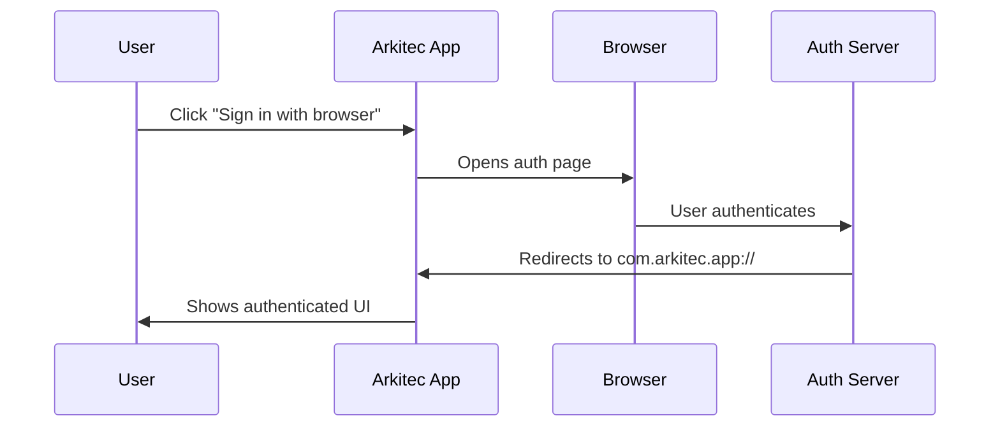

Arkitec uses a secure OAuth flow to authenticate users via their system browser. The authentication system supports both automatic deep-link redirects and a manual code entry fallback for environments where deep-links may not work.

## How Authentication Works

Authentication in Arkitec is built on [Better Auth](https://www.better-auth.com/) with an Electron-specific implementation that bridges the gap between your desktop application and the web-based authentication server.

<Steps>
  <Step title="Protocol Registration">
    When Arkitec starts, it registers the `com.arkitec.app://` custom protocol with your operating system. This allows the authentication server to redirect back to the desktop app after successful sign-in.
  </Step>
  
  <Step title="Browser Sign-In">
    When you click "Sign in with browser" or "Continue with Google", Arkitec opens your system browser to the authentication page. The app uses PKCE (Proof Key for Code Exchange) to ensure the authentication flow is secure.
  </Step>
  
  <Step title="Redirect or Manual Code">
    After successful authentication:
    - **Deep-link works**: Browser redirects to `com.arkitec.app://callback` and the app automatically receives the session
    - **Deep-link fails**: The web page displays a 32-character authorization code that you can paste into the app
  </Step>
  
  <Step title="Session Established">
    Once authenticated, your session is stored securely in Electron's storage system and persists across app restarts.
  </Step>
</Steps>

## Authentication Paths

### Standard Deep-Link Flow

This is the preferred authentication path when deep-links are properly registered:



<Tip>
  Deep-links should work automatically on macOS and Windows. On Linux, you may need to manually register the protocol handler.
</Tip>

### Manual Code Fallback

If the deep-link redirect doesn't work, you can manually complete authentication:

<Steps>
  <Step title="Initiate Sign-In">
    Click "Sign in with browser" in the Arkitec app. This creates the necessary verification state in the main process.
  </Step>
  
  <Step title="Complete Web Authentication">
    Authenticate in your browser (Google, email, etc.). After success, you'll see a 32-character authorization code.
  </Step>
  
  <Step title="Paste Code">
    Return to Arkitec, expand the "Paste authorization code" section, and paste the code.
  </Step>
  
  <Step title="Complete Authentication">
    Click "Authenticate code" to exchange the code for a session.
  </Step>
</Steps>

<Warning>
  The authorization code is **short-lived** and can only be used once. If it expires, you'll need to start the authentication flow again.
</Warning>

## Architecture

### Main Process (`auth.service.ts`)

The authentication service in the main process handles:

- Protocol registration and deep-link handling
- Secure session storage
- Session validation with the auth server
- Cookie management for API requests

```typescript
import { createAuthClient } from "better-auth/client";
import { electronClient } from "@better-auth/electron/client";

const client = createAuthClient({
  baseURL: BASE_URL,
  basePath: "/auth",
  plugins: [
    electronClient({
      signInURL: SIGN_IN_URL,
      protocol: {
        scheme: "com.arkitec.app",
      },
      storage: storage(),
    }),
  ],
});

// Must be called before app ready
client.setupMain();
```

### Preload Bridge

The preload script exposes safe authentication methods to the renderer:

- `window.requestAuth()` - Initiates the browser sign-in flow
- `window.authenticate({ token })` - Exchanges a manual code for a session
- `window.getUser()` - Retrieves the current authenticated user
- `window.onAuthenticated()` - Listens for authentication success events
- `window.signOut()` - Signs out the current user

### Renderer Process

The renderer uses React hooks to manage auth state:

```typescript
const { user, status, signIn, signOut } = useAuth();

if (status === 'loading') return <LoadingSpinner />;
if (status === 'unauthenticated') return <SignIn signIn={signIn} />;

return <AuthenticatedApp user={user} />;
```

## Authentication States

The app manages three core authentication states:

<Accordion title="loading">
  The initial state when the app is checking for a persisted session. The app calls `window.getUser()` on mount to restore the previous session if it exists.
</Accordion>

<Accordion title="unauthenticated">
  No valid session exists. The app displays the sign-in card with options to authenticate via browser or paste a manual code.
</Accordion>

<Accordion title="authenticated">
  A valid session exists and the user can access the full application. The session is automatically validated with the server periodically.
</Accordion>

## Configuration

Authentication configuration is handled via environment variables:

```bash
# Override the default auth server URL
export ARKITEC_BASE_URL="https://api.arkitec.dev"

# Override the sign-in page URL
export ARKITEC_SIGN_IN_URL="https://app.arkitec.dev/login"
```

## Session Management

### Session Persistence

Sessions are persisted in Electron's secure storage and automatically restored when you relaunch Arkitec. The session includes:

- User profile information (name, email, avatar)
- Authentication tokens
- Refresh token for seamless reauthentication

### Session Validation

The app periodically validates your session with the server using `getSession()`:

```typescript
const sessionResult = await authService.getSession();

if (!sessionResult.success) {
  // Session invalid, show sign-in
}
```

### Cookie Management

The auth service provides a cookie getter for authenticating API requests:

```typescript
const cookie = authService.cookie;

fetch('/api/endpoint', {
  headers: {
    'Cookie': cookie
  }
});
```

## Security Considerations

<Warning>
  **Never expose the main auth client directly to the renderer process.** Always use the preload bridge to safely expose authentication methods.
</Warning>

### PKCE Flow

Arkitec uses PKCE (Proof Key for Code Exchange) to prevent authorization code interception attacks. The code verifier is generated in the main process and never exposed to the renderer or browser.

### Storage Security

Authentication tokens are stored using Electron's secure storage system, which:
- Uses the operating system's credential storage (Keychain on macOS, Credential Manager on Windows)
- Encrypts data at rest
- Requires the app to be running to access the tokens

### Manual Code Exchange

The manual code exchange flow requires that:
1. `requestAuth()` was called first (to generate the PKCE verifier)
2. The code is exactly 32 characters
3. The code hasn't expired (short-lived, typically 5-10 minutes)
4. The code hasn't been used before

## Troubleshooting

### Deep-Link Not Working

If the browser doesn't redirect back to Arkitec:

1. **Check protocol registration**: The custom protocol should be registered during installation
2. **Use manual code**: Click the code shown in the browser and paste it into Arkitec
3. **Linux users**: You may need to manually register the protocol handler:

```bash
xdg-mime default arkitec.desktop x-scheme-handler/com.arkitec.app
```

### "Invalid Code" Error

This error occurs when:
- The code has expired (generate a new one)
- You didn't click "Sign in with browser" first
- The code was already used
- There's a typo in the pasted code

### Session Not Persisting

If you're signed out every time you restart:

1. Check that Electron has permission to access secure storage
2. Look for errors in the console during `getUser()` call
3. Verify that the auth server is accessible

## API Reference

### AuthService Methods

<Accordion title="setupMain()">
  Initializes the auth client and registers the protocol handler. **Must be called before the Electron app is ready.**
  
  ```typescript
  authService.setupMain();
  ```
</Accordion>

<Accordion title="getSession()">
  Fetches the current session from the auth server for validation.
  
  ```typescript
  const result = await authService.getSession();
  
  if (result.success) {
    console.log('User:', result.data.user);
    console.log('Session:', result.data.session);
  }
  ```
</Accordion>

<Accordion title="cookie (getter)">
  Returns the Better Auth cookie string for authenticating API requests.
  
  ```typescript
  const cookie = authService.cookie;
  ```
</Accordion>

### Window Bridge Methods (Renderer)

<Accordion title="window.requestAuth(provider?)">
  Opens the system browser to begin authentication.
  
  ```typescript
  window.requestAuth(); // Default provider
  window.requestAuth('google'); // Specific provider
  ```
</Accordion>

<Accordion title="window.authenticate({ token })">
  Exchanges a manual authorization code for a session.
  
  ```typescript
  window.authenticate({ 
    token: 'abc123...xyz' // 32-char code
  });
  ```
</Accordion>

<Accordion title="window.onAuthenticated(callback)">
  Subscribe to authentication success events.
  
  ```typescript
  window.onAuthenticated((user) => {
    console.log('Authenticated as:', user.name);
  });
  ```
</Accordion>